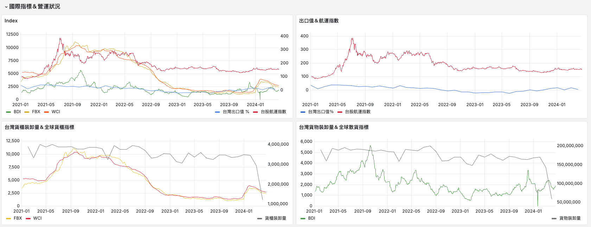

# Marine Time
[Website](https://marine-time.online) |  [Introdcution Video](https://www.youtube.com/watch?v=6bKpNwKqo4E)
## Overview

A platform providing daily port information and detailed market trend analytics from international indexes. The platform features an animated map built with Leaflet to visualize data over a rolling 12-month period.
## Objective
Marine Time aims to gather comprehensive information about the shipping industry, bringing together a wealth of data and insights in one platform. 
This website is a heartfelt tribute to my beloved grandpa, who was a captain throughout his whole life and became an angel during the development.
Through this endeavor, I honor his memory and his enduring influence on my life.

## Table of Contents

- [Overview](#overview)
- [Objective](#objective)
- [Features](#features)
- [Technologies Used](#technologies-used)
- [Demo](#demo)
- [Introduction Video](#introduction-video)
- [Architecture](#architecture)
  - [Server/DB Monitoring Architecture](#serverdb-monitoring-architecture)
  - [Component Specification](#component-specification)
  - [Data Pipeline Detail](#data-pipeline-detail)
  - [Web Server Detail](#web-server-detail)
- [Monitoring](#monitoring)

- [Contact](#contact)

## Features

- **Port Information Visualization**: 
  - Daily port congestion and on-berth ships update
  - International indexes: WCI, FBX, BDI 
  - Taiwan indexes: Taiwan Ship Stock Index, Taiwan Export Value Changes 
  - Monthly ports operation status
- **Ship Industry Analytics**: 
  - **Static Analysis**: Analyze historical data and trends from various international indexes.
  - **Business Analysis**: Gain insights into current market conditions and future trends to inform business decisions.
- **Animated Map**: Visualize data trends over 12 months using a dynamic map.

## Technologies Used

- **Frontend**: Leaflet, Grafana, Matplotlib
- **Programming Languages**: Python, JavaScript
- **Framework**: Flask
- **Tools**: Docker, Selenium
- **Database**: InfluxDB
- **Monitoring**: AWS CloudWatch, Prometheus, Telegraf
- **Cloud Service (AWS)**: EC2, Lambda, EventBridge, ALB, ASG, CloudWatch, S3, Route53

## Demo
### Port Daily Update 
(captured on May 23, 2024)
### Port Operation Update

### International Indexes 

## Introduction Video
[Introdcution Video](https://www.youtube.com/watch?v=6bKpNwKqo4E)

## Architecture

### Data Pipeline Detail

- **Data Source**:
  - Maritime Port Bureau - Ports Operation Status (商港營運狀況)
    - update frequency: daily, monthly
  - Drewry - World Container Index (WCI) (航運指標)
    - update frequency: weekly
  - Freightos - Freightos Baltic Index (FBX) (航運指標)
    - update frequency: weekly
  - Baltic Exchange - Baltic Dry Index (BDI)(航運指標)
    - update frequency: weekly
  - Taiwan Stock Exchange - Shipping Industry Index (航運業類指數) 
    - update frequency: weekly
  - Ministry of Finance - Taiwan Export Value (台灣出口值)
    - update frequency: weekly
- **Data Collection**:
  - Python & Selenium: Selenium is used for web scraping to collect the necessary data from sources
  - AWS Lambda: Automated data collection using AWS Lambda on a scheduled basis (cron-based schedule)
- **Data Storage**:
  - Amazon S3 (Raw Data Layer): Raw data collected by AWS Lambda is stored in Amazon S3
- **Data Transformation**:
  - AWS Lambda: Another Lambda triggered by EventBridge when new data is stored into S3
  - InfluxDB (Structured Data Layer): Transformed data is written into InfluxDB, a time-series database optimized for handling large volumes of time-stamped data
### Web Server Detail

- **API Deployment**:
  - Deployed RESTful API using Flask on EC2 instances
- **Load Balancing and Scaling**:
  - Application Load Balancer (ALB) to distribute incoming traffic
  - Auto Scaling Group (ASG) to adjust EC2 instances based on CPU utilization

### Server/DB Monitoring Architecture

Marine Time employs Prometheus  for monitoring and alerting. Metrics are collected from various sources such as EC2 instances and InfluxDB. Pulling data from sources, Prometheus then stores these metrics and allows querying via Grafana for visualization. When CPU usage exceeding 70% or memory usage exceeding 80%,  Prometheus triggers alerts which are managed by Alert Manager. Alert Manager can notify users through email, ensuring critical issues are promptly addressed.

### Component Specification
- **InfluxDB**: CPU: 2 vCPUs, Memory: 4 GB
- **Grafana**: CPU: 1 vCPU, Memory: 2 GB
- **Python Application**: CPU: 1 vCPU, Memory: 2 GB
- **Prometheus**: CPU: 1 vCPU, Memory: 2 GB
- **Node Exporter**: CPU: 0.5 vCPU, Memory: 0.5 GB
- **Telegraf**: CPU: 0.5 vCPU, Memory: 0.5 GB
## Monitoring

- **Real-Time Monitoring**:
  - Implemented real-time monitoring solutions using AWS CloudWatch, Prometheus, and Telegraf to ensure the system's performance and reliability by monitoring the server and database.
  
  
- **Data Integrity Checks**:
  - Conducted monthly data integrity checks by querying data from S3 and InfluxDB to ensure accuracy and consistency.

## Contact
[Eydie Cheng](mailto:eydie.cheng@gmail.com)

